# Aenea Project リファクタリング計画書

> 作成日: 2026-06-10
> 分析対象: `src/` 配下 全 93 ファイル(TS/TSX)+ `tests/`・`scripts/`・`package.json`
> 方針: **分析と提案のみ。コード変更は本書に含まれない。**

---

## 1. 現状の依存関係と構造的ボトルネック

### 1.1 全体依存グラフ(パッケージレベル)

```mermaid
graph TD
    subgraph entry["エントリポイント"]
        AS[server/aenea-server.ts]
        UI[ui/main.tsx → App → Dashboard / DebugConsole]
    end

    subgraph server["server/ (インフラ + オーケストレーション)"]
        CB[consciousness-backend.ts<br/>★ ~3,070行 God Object]
        DBM[database-manager.ts<br/>★ ~2,170行 / 21テーブル]
        AIX[ai-executor.ts]
        LOG[logger.ts]
        DH[dialogue-handler.ts]
        WS[websocket-handler.ts]
        RT[routes/* 10ファイル]
        CCS[content-cleanup-service.ts]
    end

    subgraph aenea["aenea/ (ドメイン層のはずの層)"]
        ST[stages/ S1-S6+weight-update]
        MEM[memory/ core-beliefs, memory-consolidator]
        SOM[somnia/ 体性層]
        MOR[mortality/ 寿命・死]
        DPD[core/dpd-engine.ts ★2,029行]
        IT[core/internal-trigger.ts 1,152行]
        AG[agents/ ペルソナ設定]
        SAIP[integration/saip.ts, energy-sync.ts]
    end

    subgraph legacy["レガシー / 未参照クラスタ(本番経路から到達不能)"]
        ACC[aenea/core/consciousness.ts 1,173行]
        AF[integration/agent-factory.ts 746行]
        YB[integration/yui-bridge.ts 1,504行]
        AAA[aenea/agents/aenea-agent-adapter.ts]
        SM[aenea/memory/session-memory.ts]
        SLM[aenea/consciousness/sleep-manager.ts]
        RS[aenea/stages/response-synthesis.ts]
        GM[utils/growth-metrics.ts 1,040行]
        PR[utils/pseudorandom.ts 628行]
    end

    subgraph utils["utils/"]
        EM[energy-management.ts]
        QC[question-categorizer.ts 1,184行]
        JP[json-parser.ts]
        SC[system-clock.ts 1,006行]
    end

    subgraph types["types/ (型定義)"]
        TY[aenea-types ⇄ dpd-types ⇄ consciousness-types<br/>★ 循環依存 SCC]
    end

    RAG[rag/ 自己完結・良好]
    YP[yui-protocol/dist<br/>外部プロジェクトの build 成果物]

    AS --> CB & RT & WS
    RT --> CB
    WS --> CB
    DH --> CB
    CB --> ST & MEM & SOM & MOR & AG & SAIP & DBM & AIX & EM & QC & JP & IT & CCS
    ST -->|逆流| DBM & AIX & LOG
    MEM -->|逆流| DBM & AIX & LOG
    MOR -->|逆流| DBM & AIX & LOG
    SOM -->|逆流| LOG
    IT -->|逆流| DBM
    IT --> RAG
    JP -->|逆流| LOG
    ST --> RAG
    ST -.動的import.-> YP
    ACC --> AF --> YB --> YP
    UI -.HTTP/WS のみ・健全.-> AS
```



凡例: `-->|逆流|` = ドメイン層からインフラ層への逆向き依存(レイヤー違反)。

### 1.2 循環依存

| # | 循環 | 種別 | 深刻度 |
|---|------|------|--------|
| C1 | `types/aenea-types.ts` ⇄ `types/dpd-types.ts` | ファイルレベル(import 双方向) | 高 |
| C2 | `types/dpd-types.ts` ⇄ `types/consciousness-types.ts`(`dpd-types.ts:52` の inline `import('./somnia-types.js')` 含め 4 型ファイルが事実上 1 つの強連結成分) | ファイルレベル | 高 |
| C3 | `server/` ⇄ `aenea/`:`consciousness-backend` → `aenea/stages/*` → `server/{database-manager, ai-executor, logger}` | パッケージレベル | **最重要** |
| C4 | `server/` ⇄ `utils/`:`consciousness-backend` → `utils/json-parser` → `server/logger` | パッケージレベル | 中 |
| C5 | `server/dialogue-handler` →(type-only)→ `consciousness-backend`、逆向きは routes 経由で実体注入 | 弱い循環(型のみ) | 低 |

ファイルレベルの真の循環は types クラスタに集中している。一方 C3 のパッケージ循環は「`aenea/` がドメイン層として独立できていない」ことを意味し、テスト容易性・再利用性を最も損なっている。

### 1.3 God Object

| ファイル | 行数 | 抱えている責務 |
|---|---|---|
| [consciousness-backend.ts](../src/server/consciousness-backend.ts) | ~3,070 | ①ライフサイクル(start/stop/pause)②思考ループ ③S1–S6 パイプライン編成 ④フォールバック DPD 採点 ⑤質問管理・カテゴリ統計 ⑥**睡眠モード一式(~500行、インライン実装)** ⑦Yui 5 エージェント対話 ⑧刺激/応答処理 ⑨夢パターン・記憶インサイト生成 ⑩エネルギー管理 ⑪mortality 配線 ⑫人格スナップショット ⑬DB からの状態復元 — import 数 36 |
| [database-manager.ts](../src/server/database-manager.ts) | ~2,170 | **21 テーブル**(consciousness_state, questions, thought_cycles, dpd_weights, core_beliefs, dialogues, somnia_state, mortality_state, last_words …)を 1 クラスで管理。全ドメイン文脈の永続化が集中 |
| [dpd-engine.ts](../src/aenea/core/dpd-engine.ts) | 2,029 | DPD 評価・重み進化・プロンプト構築が同居 |
| [yui-bridge.ts](../src/integration/yui-bridge.ts) | 1,504 | レガシー(後述)。yui-protocol 接続+アダプタ+状態管理 |
| [DebugConsole.tsx](../src/ui/pages/DebugConsole.tsx) | 1,167 | UI 層。表示・コマンド処理・インライン CSS が同居(優先度は低) |

### 1.4 レイヤー越え(ドメイン → インフラの逆流)

`aenea/` はドメイン層であるべきだが、以下が `server/` を直接 import している:

- [individual-thought.ts](../src/aenea/stages/individual-thought.ts) → `server/ai-executor`, `server/database-manager`, `server/logger`
- [response-synthesis.ts](../src/aenea/stages/response-synthesis.ts) → `server/database-manager`, `server/ai-executor`
- [yui-consultation.ts](../src/aenea/stages/yui-consultation.ts:209) → `server/ai-executor` + **`../../../yui-protocol/dist/agents/*.js` を動的 import**(プロジェクト境界の突き抜け)
- [memory-consolidator.ts](../src/aenea/memory/memory-consolidator.ts) / [core-beliefs.ts](../src/aenea/memory/core-beliefs.ts) → `server/database-manager`, `server/ai-executor`, `server/logger`
- [sleep-manager.ts](../src/aenea/consciousness/sleep-manager.ts) / [death-handler.ts](../src/aenea/mortality/death-handler.ts) → 同上
- [state-machine.ts](../src/aenea/somnia/state/state-machine.ts) → `server/logger`
- [internal-trigger.ts](../src/aenea/core/internal-trigger.ts) → `server/database-manager`(type import)
- [json-parser.ts](../src/utils/json-parser.ts) → `server/logger`(utils → server)

また [yui-bridge.ts:15](../src/integration/yui-bridge.ts) は `../../yui-protocol/dist/kernel/...` を相対パスで import しており、`package.json` に `"yui-protocol": "file:./yui-protocol"` が宣言されているにもかかわらずパッケージ境界をバイパスしている。

### 1.5 デッドコード / 二重実装(本番経路から未参照)

本番エントリ(`aenea-server.ts` → `consciousness-backend.ts`)から到達できないモジュール群。**合計 ~6,500 行**:

| モジュール | 行数 | 状況 |
|---|---|---|
| `aenea/core/consciousness.ts`(AeneaConsciousness) | 1,173 | `ConsciousnessBackend` と並行する**旧世代の意識実装**。テストのみが参照 |
| `integration/yui-bridge.ts` | 1,504 | 上記からのみ参照 |
| `integration/agent-factory.ts` | 746 | 同上 |
| `aenea/agents/aenea-agent-adapter.ts` | 439 | どこからも import されない。さらに **`AeneaAgentAdapter` クラスが 3 箇所に重複定義**(yui-bridge.ts:935 / agent-factory.ts:230 / 本ファイル) |
| `aenea/consciousness/sleep-manager.ts` | 372 | `ConsciousnessBackend.enterSleepMode()`(インライン ~500 行)と**ロジック二重実装**。テストは SleepManager 側を検証しており、本番コードはテストされていない方を実行している |
| `aenea/stages/response-synthesis.ts`(S7) | 287 | 定義のみ。パイプラインに未配線 |
| `aenea/memory/session-memory.ts` | 268 | 未参照 |
| `utils/growth-metrics.ts` | 1,040 | 未参照(backend は独自の `getGrowthMetrics()` を持つ)。テストのみ参照 |
| `utils/pseudorandom.ts` | 628 | 未参照 |

### 1.6 健全な部分(維持すべき)

- **`rag/`**: config/embedder/chunker/vectordb/retriever/ingest が `index.ts` ファサードに集約。自己完結で模範的
- **UI ⇔ サーバー**: UI は HTTP/WebSocket 経由のみで結合。コードレベルの依存なし
- **`integration/yui-agents-bridge.ts`**: import ゼロの自己完結設計(executor をコールバック注入)
- **stages の分割粒度**: S1–S6 が 1 ファイル 1 ステージで分かれている点は良い(依存方向だけが問題)

---

## 2. アーキテクチャ方針

### 2.1 目標とするレイヤー構造

```
types/shared (循環なしの型基盤)
    ↑
aenea/  (ドメイン層: パイプライン・DPD・Somnia・Mortality・Memory)
    │   依存してよいのは types と「ポート(インターフェース)」のみ
    ↑
server/ (インフラ + アプリケーション層: DB・AI 実行・HTTP/WS・ロギング)
    │   ドメインのポートに対する「アダプタ」を提供し、DI で注入する
    ↑
ui/     (HTTP/WS のみで結合 — 現状維持)
```

**鉄則: 依存は常に下向き(`server → aenea → types`)。`aenea/` から `server/` への import をゼロにする。**

### 2.2 ポート&アダプタ(依存性逆転)

ドメインが必要とするインフラ機能を `aenea/ports/` にインターフェースとして定義し、実装は `server/` 側に置く:

- `LoggerPort` — 現 `server/logger` の `log` 関数シグネチャを抽出
- `AIExecutorPort` — `execute(prompt, systemPrompt, …)` の抽象。Gemini/Ollama 実装は server 側
- リポジトリ群 — `ThoughtRepository` / `BeliefRepository` / `DPDWeightsRepository` / `SomniaStateRepository` / `MortalityRepository` / `DialogueRepository` / `SleepLogRepository`

stages・memory・mortality・somnia はコンストラクタ注入でポートを受け取る(現在すでに `DatabaseManager` と `AIExecutor` をコンストラクタで受けている箇所が多いため、**型をインターフェースに差し替えるだけで済む箇所が大半**)。

### 2.3 God Object の分解方針

**ConsciousnessBackend** → ファサード + 5 サービスへ:

| 新サービス | 引き受ける責務(現 backend の該当領域) |
|---|---|
| `ConsciousnessLifecycle` | start/stop/pause/resume・思考ループ・サイクル間隔制御・サーキットブレーカー |
| `ThoughtPipeline` | S1–S6 + weight-update の編成、フォールバック DPD 採点 |
| `SleepService` | `enterSleepMode` 一式 → **既存 `SleepManager` に一本化**(二重実装解消) |
| `StimulusDialogueService` | 刺激処理・観測可能応答・Yui 5 エージェント対話(`yui-agents-bridge` 委譲) |
| `IntrospectionService` | 質問管理・カテゴリ統計・夢パターン・成長メトリクス・人格スナップショット |

routes / websocket-handler から見た公開 API は薄いファサード(現 `ConsciousnessBackend` クラス名を維持)で互換を保ち、内部実装のみ段階的に委譲へ置き換える。

**DatabaseManager** → 接続管理(`Database` 生成・migration)だけを残し、21 テーブルをドメイン文脈ごとのリポジトリへ分割(consciousness / thought / dpd / belief・memory / dialogue / somnia / mortality / sleep)。

### 2.4 型循環の解消方針

- 共有プリミティブ(`EmotionalState`, `SystemState`, ID 型など)を `types/shared.ts` に切り出し、`aenea-types` / `dpd-types` / `consciousness-types` / `somnia-types` は **shared に対してのみ下向き依存**にする
- `dpd-types.ts:52` の `somniaInfluence?: import('./somnia-types.js').DPDInfluence` のような inline import 型の隠れ依存も同時に除去

### 2.5 外部境界(yui-protocol)の腐敗防止層

`../../yui-protocol/dist/...` への直接 import(yui-bridge 静的・yui-consultation 動的)を、単一の `integration/yui-protocol-gateway.ts` に集約し、import 指定子は `file:` 依存として宣言済みの `yui-protocol` パッケージ名経由に統一する。ドメイン層は gateway のインターフェースのみを知る。

### 2.6 命名整理

`src/integration/`(yui-protocol 連携)と `src/aenea/integration/`(SAIP =認知-体性同期)が同名で意味が異なる。後者を `src/aenea/saip/` へ改名し混同を防ぐ。

---

## 3. 段階的リファクタリング・ロードマップ

> 原則: 各フェーズは独立してマージ可能・各フェーズ末で `pnpm test` と `pnpm run build` が green であること。挙動変更を一切伴わない(振る舞い保存リファクタリング)。

### Phase 1: デッドコード隔離と依存ルールの自動検査(リスク: 極小)

- **目的**: 以後のフェーズの作業面積を ~6,500 行削減し、退行を機械検知できる土台を作る
- **対象ファイル**:
  - 削除(または `archive/` へ移動): `aenea/core/consciousness.ts`, `integration/yui-bridge.ts`, `integration/agent-factory.ts`, `aenea/agents/aenea-agent-adapter.ts`, `aenea/memory/session-memory.ts`, `utils/growth-metrics.ts`, `utils/pseudorandom.ts` と対応テスト(`tests/aenea/consciousness/consciousness.test.ts`, `tests/utils/growth-metrics.test.ts`)
  - 判断が必要: `aenea/stages/response-synthesis.ts`(S7 として配線する計画があるなら残置を README に明記、なければ削除)
  - 新規: `.dependency-cruiser.cjs`(または eslint-plugin-boundaries 設定)+ CI への組み込み — 「`aenea/ → server/` 禁止」「`utils/ → server/` 禁止」「`types/` 内循環禁止」を最初は warn で導入
- **完了条件**: 本番エントリから未到達のモジュールが 0 になる。dependency-cruiser がベースライン違反一覧(C1–C4・レイヤー違反)をレポートとして出力し CI に載る。`pnpm test` green

### Phase 2: 型循環(C1/C2)の解消(リスク: 小)

- **目的**: ファイルレベル循環をゼロにし、以後の分割作業で型がボトルネックにならないようにする
- **対象ファイル**: `types/shared.ts`(新規)、`types/aenea-types.ts`, `types/dpd-types.ts`, `types/consciousness-types.ts`, `types/somnia-types.ts`, `types/integration-types.ts`, `types/stimulus-response-types.ts` と各 import 元(機械的な import パス変更のみ)
- **完了条件**: dependency-cruiser で `types/` 内の循環検出 0 件 → ルールを error 昇格。`tsc` エラー 0
- **備考**: `verbatimModuleSyntax` / `import type` の徹底もここで実施

### Phase 3: レイヤー違反(C3/C4)の解消 — ポート&アダプタ導入(リスク: 中)

- **目的**: `aenea/` と `utils/` から `server/` への import を完全排除し、ドメインを単体テスト可能にする
- **対象ファイル**:
  - 新規: `aenea/ports/logger.ts`, `aenea/ports/ai-executor.ts`, `aenea/ports/repositories.ts`
  - 修正: §1.4 に列挙した全ファイル(stages 4 + memory 2 + sleep-manager + death-handler + state-machine + internal-trigger + json-parser)— コンストラクタ/引数の型をポートに差し替え
  - 修正: `server/consciousness-backend.ts`(組み立てルートとして具象を注入)、`server/logger.ts` / `server/ai-executor.ts`(ポート実装宣言を追加)
  - 併せて `aenea/stages/yui-consultation.ts` の動的 import を `integration/yui-protocol-gateway.ts`(新規)へ集約
- **完了条件**: dependency-cruiser の「`aenea/ → server/`」「`utils/ → server/`」ルールを error 昇格して green。stages/memory/mortality の単体テストが DB・Gemini なし(フェイクポート)で実行可能になること
- **備考**: 既存テスト(`tests/aenea/*`, `tests/utils/*`)は注入箇所の変更のみで通ること

### Phase 4: DatabaseManager のリポジトリ分割(リスク: 中)

- **目的**: 21 テーブル/2,170 行の永続化 God Object を文脈別リポジトリに分け、Phase 3 で定義したリポジトリポートの実装にする
- **対象ファイル**:
  - 新規: `server/persistence/connection.ts`(接続 + schema migration)、`server/persistence/{thought,dpd,belief,dialogue,somnia,mortality,sleep,consciousness-state}-repository.ts`
  - 修正: `server/database-manager.ts` は当面「各リポジトリへ委譲する互換ファサード」として残し、呼び出し側(consciousness-backend, dialogue-handler, routes/dialogue, mortality, memory, sleep)を段階的に直接参照へ移行
- **完了条件**: 各リポジトリが 1 ドメイン文脈のテーブルのみを所有(SQL 文の所在がファイル単位で分離)。`tests/integration/database-*.test.ts` green。`DatabaseManager` 直参照は server 内の組み立てコードのみ
- **備考**: 1 リポジトリ = 1 PR の粒度で進められる。テーブル schema 自体は変更しない

### Phase 5: ConsciousnessBackend の分解と睡眠実装の一本化(リスク: 大 → 最後)

- **目的**: ~3,070 行のオーケストレータを §2.3 の 5 サービス+ファサードに分解し、唯一残った巨大結節点を解消する
- **対象ファイル**:
  - 新規: `server/services/consciousness-lifecycle.ts`, `server/services/thought-pipeline.ts`, `server/services/stimulus-dialogue-service.ts`, `server/services/introspection-service.ts`
  - 修正: `server/consciousness-backend.ts`(ファサード化 — routes/websocket への公開シグネチャは不変)、`aenea/consciousness/sleep-manager.ts`(インライン睡眠ロジックを統合し正とする)
  - 削除: backend 内の `enterSleepMode` インライン実装(~500 行)
- **完了条件**: consciousness-backend.ts が 500 行以下のファサードになる。睡眠ロジックの実装が 1 箇所(`SleepManager`)のみで、`tests/aenea/consciousness/sleep-manager.test.ts` が本番経路と同一コードを検証している。routes / websocket-handler / UI に変更なしで全機能(start/stop/sleep/dialogue/stimulus)が動作
- **推奨順序**: SleepService → IntrospectionService → StimulusDialogueService → ThoughtPipeline → Lifecycle(切り出しやすい順)

### (任意)Phase 6: UI とドメイン語彙の整理

- `src/aenea/integration/` → `src/aenea/saip/` 改名、`DebugConsole.tsx` / `Dashboard.tsx` のインライン CSS 抽出とコンポーネント分割、`routes/internal-state.ts` が utils クラスを直接 new している箇所のファサード経由化。機能影響なしの整地作業のため、上記 5 フェーズから独立して随時実施可能

---

## 付録: 検出方法

- 依存グラフ: `src/**/*.{ts,tsx}` 全 93 ファイルの静的 import・動的 `import()`・inline import 型を抽出して構築
- 未参照判定: 本番エントリポイント(`aenea-server.ts`, `ui/main.tsx`, `scripts/*`)からの到達可能性で判定。テストのみが参照するモジュールは「本番未参照」とした
- 行数は `Measure-Object -Line` による(空行除外のため実ファイルはやや長い)
